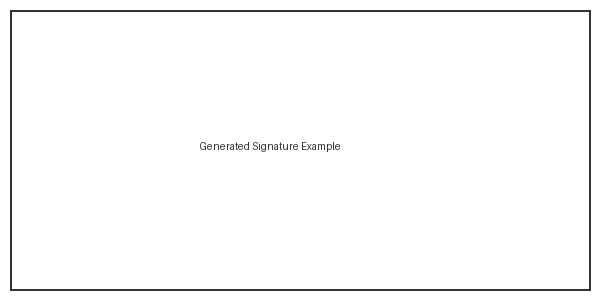

# Email Signature Generator

A professional email signature generator that creates PNG images with transparent backgrounds and outlined text for optimal readability in both light and dark mode email clients.

[](https://www.python.org/downloads/)
[](LICENSE)
[](https://github.com/psf/black)
[](https://github.com/yourusername/email-signature-generator/actions)
[](https://codecov.io/gh/yourusername/email-signature-generator)

## ✨ Features

- **🖥️ Graphical User Interface**: Intuitive GUI with form validation, live preview, and profile management
- **🎨 Transparent Backgrounds**: Generates PNG images with RGBA transparency that work on any email client background
- **📝 Outlined Text**: Adds white outlines to text for excellent readability in both light and dark modes
- **🏢 Company Logo Integration**: Automatically finds and includes your company logo with proper sizing
- **✅ Input Validation**: Validates email addresses and phone numbers to ensure correct formatting
- **💾 Profile Management**: Save and load multiple signature profiles for different users or roles
- **👁️ Live Preview**: See your signature before generating with automatic updates
- **⚙️ Configurable**: Externalized configuration for fonts, colors, dimensions, and paths
- **🎨 Modern Design System**: Professional, accessible interface with WCAG AA compliant colors and consistent styling
- **🏗️ Clean Architecture**: Well-organized codebase following clean architecture principles
- **🧪 Comprehensive Testing**: Includes both unit tests and property-based tests for reliability
- **🌍 Cross-Platform**: Works seamlessly on Windows, macOS, and Linux

## 📸 Screenshots

### GUI Interface
The application features a modern, user-friendly interface with:
- Real-time validation with visual feedback
- Live signature preview
- Profile management for multiple users
- Customizable settings


### Example Output
Generated signatures include:
- Professional layout with company logo
- Clear, readable text with outlines
- Transparent background for any email client
- Properly formatted contact information



## 🚀 Quick Start

```bash
# Clone the repository
git clone https://github.com/yourusername/email-signature-generator.git
cd email-signature-generator

# Install dependencies (using uv - recommended)
uv sync

# Or using pip
pip install -e .

# Launch the GUI
python gui_main.py

# Or use the CLI
python main.py
```

## 📋 Table of Contents

- [Installation](#-installation)
  - [Windows](#windows-installation)
  - [macOS](#macos-installation)
  - [Linux](#linux-installation)
- [Usage](#-usage)
  - [GUI Usage](#gui-usage-recommended)
  - [CLI Usage](#cli-usage)
  - [Using Make](#using-make)
- [Configuration](#-configuration)
- [Architecture](#-architecture)
- [Development](#-development)
- [Testing](#-testing-strategy)
- [Troubleshooting](#-troubleshooting)
- [Roadmap](#-roadmap)
- [Contributing](#-contributing)
- [License](#-license)

## 📦 Installation

The email signature generator works on **Windows**, **macOS**, and **Linux**. Follow the platform-specific instructions below for the best experience.

### Windows Installation

#### Prerequisites

1. **Install Python 3.13 or higher**
   - Download from [python.org](https://www.python.org/downloads/)
   - During installation, check "Add Python to PATH"
   - Verify installation: `python --version`

2. **Install Git** (optional, for cloning)
   - Download from [git-scm.com](https://git-scm.com/download/win)

#### Using uv (Recommended)

```powershell
# Install uv
powershell -c "irm https://astral.sh/uv/install.ps1 | iex"

# Clone the repository
git clone https://github.com/yourusername/email-signature-generator.git
cd email-signature-generator

# Install dependencies
uv sync

# Activate the virtual environment
.venv\Scripts\activate
```

#### Using pip

```powershell
# Clone the repository
git clone https://github.com/yourusername/email-signature-generator.git
cd email-signature-generator

# Create a virtual environment
python -m venv .venv

# Activate the virtual environment
.venv\Scripts\activate

# Install dependencies
pip install -e .

# Install development dependencies (optional)
pip install -e ".[dev]"
```

#### Windows-Specific Notes

- **Font Locations**: Windows fonts are located in `C:\Windows\Fonts\` and `%LOCALAPPDATA%\Microsoft\Windows\Fonts\`
- **Default Fonts**: Arial, Calibri, Times New Roman
- **File Paths**: The application automatically handles Windows backslash paths
- **Opening Folders**: Uses Windows Explorer to open output folders

### macOS Installation

#### Prerequisites

1. **Install Python 3.13 or higher**
   - Using Homebrew (recommended): `brew install python@3.13`
   - Or download from [python.org](https://www.python.org/downloads/)
   - Verify installation: `python3 --version`

2. **Install Git** (usually pre-installed)
   - Verify: `git --version`
   - If needed: `xcode-select --install`

#### Using uv (Recommended)

```bash
# Install uv
curl -LsSf https://astral.sh/uv/install.sh | sh

# Clone the repository
git clone https://github.com/yourusername/email-signature-generator.git
cd email-signature-generator

# Install dependencies
uv sync

# Activate the virtual environment
source .venv/bin/activate
```

#### Using pip

```bash
# Clone the repository
git clone https://github.com/yourusername/email-signature-generator.git
cd email-signature-generator

# Create a virtual environment
python3 -m venv .venv

# Activate the virtual environment
source .venv/bin/activate

# Install dependencies
pip3 install -e .

# Install development dependencies (optional)
pip3 install -e ".[dev]"
```

#### macOS-Specific Notes

- **Font Locations**: macOS fonts are in `/Library/Fonts/`, `/System/Library/Fonts/`, and `~/Library/Fonts/`
- **Default Fonts**: Helvetica, SF Pro, Times
- **File Paths**: Uses Unix-style forward slashes
- **Opening Folders**: Uses Finder to open output folders
- **Tkinter**: Included with Python from python.org; if using Homebrew: `brew install python-tk@3.13`

### Linux Installation

#### Prerequisites

1. **Install Python 3.13 or higher**
   
   **Ubuntu/Debian**:
   ```bash
   sudo apt update
   sudo apt install python3.13 python3.13-venv python3-pip python3-tk
   ```
   
   **Fedora/RHEL**:
   ```bash
   sudo dnf install python3.13 python3-tkinter
   ```
   
   **Arch Linux**:
   ```bash
   sudo pacman -S python tk
   ```

2. **Install Git**
   ```bash
   # Ubuntu/Debian
   sudo apt install git
   
   # Fedora/RHEL
   sudo dnf install git
   
   # Arch Linux
   sudo pacman -S git
   ```

3. **Install Required Fonts** (recommended)
   ```bash
   # Ubuntu/Debian
   sudo apt install fonts-dejavu fonts-liberation
   
   # Fedora/RHEL
   sudo dnf install dejavu-sans-fonts liberation-fonts
   
   # Arch Linux
   sudo pacman -S ttf-dejavu ttf-liberation
   ```

#### Using uv (Recommended)

```bash
# Install uv
curl -LsSf https://astral.sh/uv/install.sh | sh

# Clone the repository
git clone https://github.com/yourusername/email-signature-generator.git
cd email-signature-generator

# Install dependencies
uv sync

# Activate the virtual environment
source .venv/bin/activate
```

#### Using pip

```bash
# Clone the repository
git clone https://github.com/yourusername/email-signature-generator.git
cd email-signature-generator

# Create a virtual environment
python3 -m venv .venv

# Activate the virtual environment
source .venv/bin/activate

# Install dependencies
pip3 install -e .

# Install development dependencies (optional)
pip3 install -e ".[dev]"
```

#### Linux-Specific Notes

- **Font Locations**: Linux fonts are in `/usr/share/fonts/`, `/usr/local/share/fonts/`, `~/.fonts/`, and `~/.local/share/fonts/`
- **Default Fonts**: DejaVu Sans, Liberation Sans, FreeSans
- **File Paths**: Uses Unix-style forward slashes
- **Opening Folders**: Uses `xdg-open` (with fallbacks to `gnome-open` or `kde-open`)
- **Display Server**: Requires X11 or Wayland for GUI; use CLI on headless servers

## 🎯 Usage

The email signature generator provides two interfaces: a graphical user interface (GUI) for easy visual interaction, and a command-line interface (CLI) for automation and scripting.

### Quick Start

```bash
# Launch GUI (recommended for most users)
python gui_main.py

# Or use CLI for automation
python main.py
```

### GUI Usage (Recommended)

Launch the graphical interface:

```bash
python gui_main.py
```

The GUI provides an intuitive interface with two main tabs:

#### Signature Tab
- **Form Fields**: Enter your personal information (name, position, address, phone, mobile, email, website)
- **Real-time Validation**: Fields are validated as you type with visual feedback (green checkmarks for valid, red indicators for invalid)
- **Logo Selection**: Browse and select a custom logo file with thumbnail preview
- **Preview**: See a live preview of your signature before generating
- **Generate**: Create your signature image with one click
- **Profiles**: Save and load signature data profiles for quick access to different signatures

#### Settings Tab
- **Colors**: Customize signature colors using color picker dialogs
- **Dimensions**: Adjust logo size, margins, and line spacing
- **Fonts**: Configure font paths for different operating systems
- **Save Settings**: Apply and save configuration changes

#### GUI Features
- **Visual Validation**: Invalid inputs are highlighted in red with error messages
- **Auto-Preview**: Preview updates automatically as you change data
- **Profile Management**: Save multiple signature profiles and switch between them
- **Error Handling**: Clear error messages guide you through any issues
- **Cross-Platform**: Works on Windows, macOS, and Linux

### CLI Usage

Run the command-line signature generator:

```bash
python main.py
```

The application will prompt you for:
- Your name
- Your position/title
- Your address
- Phone number (landline)
- Mobile number
- Email address
- Website (optional, defaults to www.example.com)

The generated signature will be saved as `email_signature.png` in the current directory.

### Example Session

```
=== Email Signature Generator ===

Enter your name: John Doe
Enter your position: Software Engineer
Enter your address: Anytown, USA
Enter phone number: +1 555 0100
Enter mobile number: +1 555 0101
Enter email: john.doe@example.com
Enter website (or press Enter for default): www.example.com

✓ Signature generated successfully!
  Saved to: email_signature.png
  Dimensions: 450x280 pixels
```

## 🛠️ Using Make

The project includes a Makefile that provides convenient shortcuts for common development and usage tasks.

### Quick Start with Make

```bash
# Set up the project
make install

# Run the application
make run

# Run tests
make test
```

### Available Make Targets

#### Development

- **`make install`** - Set up virtual environment and install all dependencies
- **`make clean`** - Remove generated files and caches

#### Testing

- **`make test`** - Run all tests with coverage
- **`make test-unit`** - Run only unit tests
- **`make test-property`** - Run only property-based tests
- **`make coverage`** - Open HTML coverage report

#### Code Quality

- **`make lint`** - Run ruff linter
- **`make lint-fix`** - Run ruff with auto-fix
- **`make format`** - Format code with black
- **`make format-check`** - Check formatting without changes
- **`make typecheck`** - Run mypy type checker
- **`make check`** - Run all quality checks

#### Application

- **`make run`** - Run the email signature generator

#### Help

- **`make help`** or **`make`** - Display available targets

### Example Workflows

#### First-Time Setup

```bash
# Clone and set up the project
git clone https://github.com/yourusername/email-signature-generator.git
cd email-signature-generator
make install

# Verify installation
make test
```

#### Daily Development Workflow

```bash
# Make code changes
# ...

# Format and check code quality
make format
make check

# Run tests
make test

# View coverage report
make coverage
```

#### Before Committing

```bash
# Run all quality checks
make check

# Run all tests
make test

# If everything passes, commit your changes
git add .
git commit -m "Your commit message"
```

## ⚙️ Configuration

The application uses a YAML configuration file located at `config/default_config.yaml`. The configuration automatically adapts to your platform, but you can customize settings as needed.

### Platform-Specific Configuration

The application automatically detects your operating system and uses appropriate defaults. However, you can customize paths and settings for your specific platform.

#### Font Configuration by Platform

**Windows**:
```yaml
signature:
  fonts:
    windows:
      - "C:\\Windows\\Fonts\\arialbd.ttf"      # Arial Bold
      - "C:\\Windows\\Fonts\\arial.ttf"        # Arial Regular
```

**macOS**:
```yaml
signature:
  fonts:
    macos:
      - "/System/Library/Fonts/Helvetica.ttc"
      - "/System/Library/Fonts/HelveticaNeue.ttc"
```

**Linux**:
```yaml
signature:
  fonts:
    linux:
      - "/usr/share/fonts/truetype/dejavu/DejaVuSans-Bold.ttf"
      - "/usr/share/fonts/truetype/dejavu/DejaVuSans.ttf"
```

#### Finding Fonts on Your System

**Windows**:
```powershell
# Open Fonts folder
explorer C:\Windows\Fonts

# List fonts in PowerShell
Get-ChildItem C:\Windows\Fonts\*.ttf
```

**macOS**:
```bash
# List system fonts
ls /System/Library/Fonts/

# Search for specific font
find /System/Library/Fonts/ -name "*Helvetica*"
```

**Linux**:
```bash
# List all available fonts
fc-list

# Search for specific font
fc-list | grep -i dejavu

# Refresh font cache after installing new fonts
fc-cache -fv
```

### Other Configuration Options

#### Dimensions
```yaml
signature:
  dimensions:
    logo_height: 70        # Logo height in pixels
    margin: 15             # Margin around content
    logo_margin_right: 20  # Space between logo and text
    line_height: 22        # Line spacing for text
```

#### Colors
```yaml
  colors:
    outline: [255, 255, 255]      # White outline color
    name: [51, 51, 51]             # Dark gray for name
    details: [100, 100, 100]       # Medium gray for details
    separator: [200, 0, 40, 200]   # Red separator line with alpha
    confidentiality: [150, 150, 150]  # Light gray for legal text
```

## 🏗️ Architecture

The application follows clean architecture principles with clear separation of concerns:

```
┌─────────────────────────────────────────────────────────┐
│                  Interface Layer                         │
│         ┌──────────────┐      ┌──────────────┐         │
│         │ CLI Interface│      │ GUI Interface│         │
│         │              │      │  (Tkinter)   │         │
│         └──────────────┘      └──────────────┘         │
└────────────────────┬──────────────────┬─────────────────┘
                     │                  │
┌────────────────────▼──────────────────▼─────────────────┐
│              Application Layer                           │
│         (Use Cases & Orchestration)                      │
│  - GenerateSignatureUseCase                             │
└────────────────────┬────────────────────────────────────┘
                     │
┌────────────────────▼────────────────────────────────────┐
│                Domain Layer                              │
│           (Business Logic & Models)                      │
│  - SignatureData (model)                                │
│  - InputValidator                                        │
│  - SignatureConfig                                       │
└─────────────────────────────────────────────────────────┘
                     │
┌────────────────────▼────────────────────────────────────┐
│            Infrastructure Layer                          │
│        (External Dependencies)                           │
│  - ImageRenderer                                         │
│  - LogoLoader                                            │
│  - FileSystemService                                     │
└─────────────────────────────────────────────────────────┘
```

### Layer Responsibilities

- **Interface Layer** (`src/email_signature/interface/`): Handles user interaction via CLI or GUI
- **Application Layer** (`src/email_signature/application/`): Orchestrates business logic through use cases
- **Domain Layer** (`src/email_signature/domain/`): Contains core business logic, models, and validation
- **Infrastructure Layer** (`src/email_signature/infrastructure/`): Handles external dependencies like file I/O and image processing

## 👨‍💻 Development

### Setup Development Environment

The easiest way to set up the development environment is using Make:

```bash
make install
```

Alternatively, you can install manually:

```bash
# Install with development dependencies
uv sync --all-extras

# Or with pip
pip install -e ".[dev]"
```

### Running Tests

Using Make (recommended):

```bash
# Run all tests with coverage
make test

# Run only unit tests
make test-unit

# Run only property-based tests
make test-property

# View coverage report
make coverage
```

Or directly with pytest:

```bash
# Run all tests
pytest

# Run with coverage report
pytest --cov=src/email_signature --cov-report=html

# Run only unit tests
pytest tests/unit/

# Run only property-based tests
pytest tests/property/
```

### Code Quality

Using Make (recommended):

```bash
# Run all quality checks
make check

# Format code
make format

# Lint code
make lint

# Type check
make typecheck
```

Or directly with the tools:

```bash
# Format code with black
black src/ tests/

# Type checking with mypy
mypy src/

# Lint with ruff
ruff check src/ tests/

# Fix auto-fixable issues
ruff check --fix src/ tests/
```

### Project Structure

```
email-signature-generator/
├── src/
│   └── email_signature/
│       ├── domain/           # Business logic and models
│       ├── application/      # Use cases
│       ├── infrastructure/   # External dependencies
│       └── interface/        # User interfaces
├── tests/
│   ├── unit/                 # Unit tests
│   └── property/             # Property-based tests
├── config/
│   └── default_config.yaml   # Default configuration
├── profiles/                 # Saved signature profiles (JSON)
├── gui_main.py               # GUI entry point
├── main.py                   # CLI entry point
└── Makefile                  # Development shortcuts
```

## 🧪 Testing Strategy

The project uses a dual testing approach:

### Unit Tests
- Test individual components in isolation
- Verify specific examples and edge cases
- Located in `tests/unit/`
- 59 tests covering all major functionality

### Property-Based Tests
- Use Hypothesis library to test with randomly generated inputs
- Verify universal properties across many inputs (100+ iterations)
- Located in `tests/property/`
- Cover correctness properties like:
  - Transparency preservation
  - Logo aspect ratio preservation
  - Input validation correctness
  - Error handling behavior

### Test Coverage

Current test coverage: **High** (see coverage report with `make coverage`)

- Domain layer: Fully covered
- Application layer: Fully covered
- Infrastructure layer: Fully covered
- Interface layer: Core functionality covered

## 🔧 Troubleshooting

### Common Issues

#### GUI Won't Start

If the GUI fails to launch:
1. Verify Python version is 3.13 or higher: `python --version`
2. Check that Tkinter is available: `python -c "import tkinter"`
3. Ensure all dependencies are installed: `pip install -e .`

#### Logo Not Found

If you see "Logo file not found", ensure:
1. Your logo file is named `logo.png` or `logo.jpg`
2. The logo is in the current directory or `./logo/` subdirectory
3. Update `config/default_config.yaml` to add custom search paths
4. In the GUI, use the "Browse" button to select a logo file directly

#### Font Loading Issues

If fonts fail to load:
1. The application will automatically fall back to system default fonts
2. Check the font paths in `config/default_config.yaml` match your system
3. Install platform-specific fonts (see Installation sections)

### Platform-Specific Issues

See the detailed troubleshooting sections in the full documentation for:
- Windows-specific issues
- macOS-specific issues
- Linux-specific issues

## 🗺️ Roadmap

### Version 1.0 (Current)
- ✅ GUI interface with Tkinter
- ✅ CLI interface
- ✅ Profile management
- ✅ Live preview
- ✅ Cross-platform support (Windows, macOS, Linux)
- ✅ Comprehensive testing (unit + property-based)
- ✅ Configuration management

### Version 1.1 (Planned)
- [ ] **HTML Signature Output**: Generate HTML signatures in addition to PNG
- [ ] **Batch Processing**: Generate signatures for multiple users from CSV/Excel
- [ ] **Template System**: Multiple signature templates to choose from
- [ ] **Dark Mode**: Dark theme for the GUI
- [ ] **Signature Preview in Email Clients**: Preview how signature looks in different email clients

### Version 1.2 (Future)
- [ ] **Web Interface**: Browser-based signature generator
- [ ] **Cloud Storage Integration**: Save signatures to cloud services (Dropbox, Google Drive)
- [ ] **QR Code Support**: Add QR codes to signatures (vCard, website, etc.)
- [ ] **Social Media Icons**: Add social media links with icons
- [ ] **Multi-language Support**: Internationalization (i18n) for UI

### Version 2.0 (Long-term)
- [ ] **API Service**: RESTful API for signature generation
- [ ] **Database Backend**: Store profiles in database instead of JSON files
- [ ] **User Authentication**: Multi-user support with authentication
- [ ] **Admin Dashboard**: Web-based admin panel for managing users and templates
- [ ] **Analytics**: Track signature usage and engagement
- [ ] **Email Client Plugins**: Direct integration with Outlook, Thunderbird, etc.

### Community Requests
Have a feature request? [Open an issue](https://github.com/yourusername/email-signature-generator/issues) with the `enhancement` label!

## 🤝 Contributing

Contributions are welcome! Here's how you can help:

### Reporting Bugs

1. Check if the bug has already been reported in [Issues](https://github.com/yourusername/email-signature-generator/issues)
2. If not, create a new issue with:
   - Clear description of the bug
   - Steps to reproduce
   - Expected vs actual behavior
   - Your environment (OS, Python version, etc.)
   - Screenshots if applicable

### Suggesting Features

1. Check the [Roadmap](#-roadmap) to see if it's already planned
2. Open an issue with the `enhancement` label
3. Describe the feature and why it would be useful
4. Include mockups or examples if applicable

### Contributing Code

1. Fork the repository
2. Create a feature branch: `git checkout -b feature/amazing-feature`
3. Make your changes
4. Run tests: `make test`
5. Run quality checks: `make check`
6. Commit your changes: `git commit -m 'Add amazing feature'`
7. Push to the branch: `git push origin feature/amazing-feature`
8. Open a Pull Request

### Development Guidelines

- Follow the existing code style (enforced by black and ruff)
- Write tests for new features
- Update documentation as needed
- Keep commits atomic and well-described
- Ensure all tests pass before submitting PR

### Code of Conduct

- Be respectful and inclusive
- Welcome newcomers and help them get started
- Focus on constructive feedback
- Assume good intentions

## 📄 License

This project is licensed under the MIT License - see the [LICENSE](LICENSE) file for details.

## 🙏 Acknowledgments

- Built with [Pillow](https://python-pillow.org/) for image processing
- GUI powered by [Tkinter](https://docs.python.org/3/library/tkinter.html)
- Testing with [pytest](https://pytest.org/) and [Hypothesis](https://hypothesis.readthedocs.io/)
- Configuration with [PyYAML](https://pyyaml.org/)

## 🐳 Docker Usage

Run the application using Docker:

```bash
# Build the Docker image
docker build -t email-signature-generator .

# Run the container
docker run -it --rm -v $(pwd)/output:/app/output email-signature-generator

# Or use docker-compose
docker-compose up
```

## 📞 Support

- **Documentation**: See this README and [MANUAL_TESTING_GUIDE.md](MANUAL_TESTING_GUIDE.md)
- **Issues**: [GitHub Issues](https://github.com/yourusername/email-signature-generator/issues)
- **Discussions**: [GitHub Discussions](https://github.com/yourusername/email-signature-generator/discussions)

## 👥 Contributors

We value all contributors who help make this project better! Whether you've submitted a bug report, suggested a feature, or contributed code, your help is appreciated.

<!-- ALL-CONTRIBUTORS-LIST:START -->
Thanks goes to these wonderful people who have contributed to this project.
<!-- ALL-CONTRIBUTORS-LIST:END -->

See the [contributor graph](https://github.com/yourusername/email-signature-generator/graphs/contributors) for a full list of contributors.

## ⭐ Star History

If you find this project useful, please consider giving it a star on GitHub!

---

Made with ❤️ by the Email Signature Generator team
